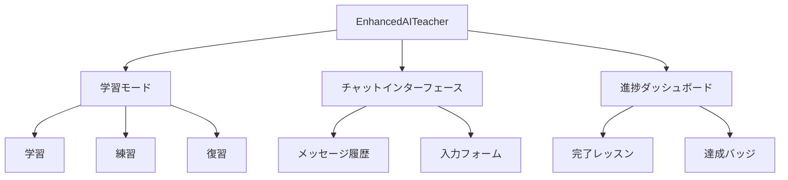
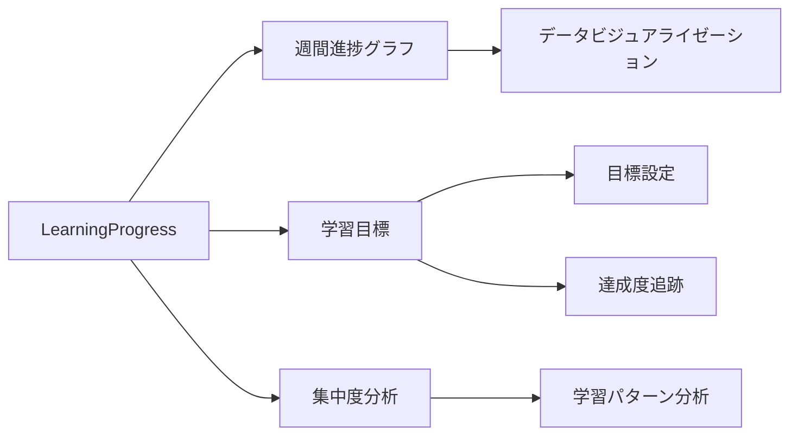
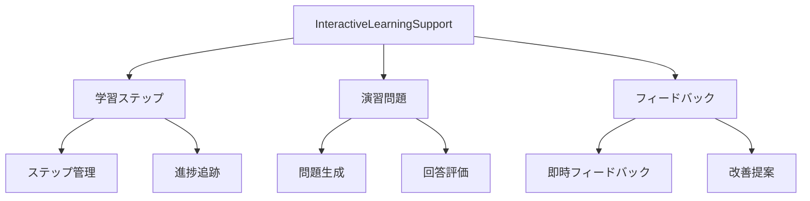
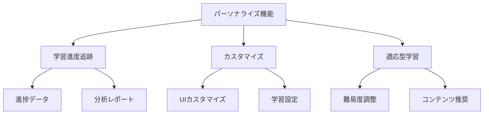
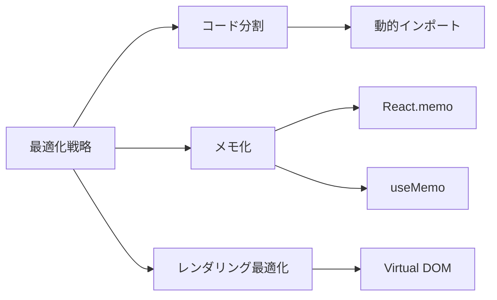
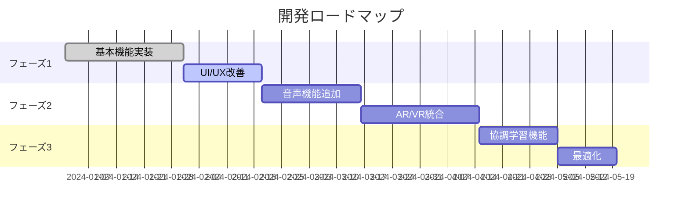

# AI Teacher アプリケーション開発ドキュメント

## プロジェクト概要

AIを活用したインタラクティブな学習支援プラットフォームの開発プロジェクト。

## プロジェクト構造

```
ai-teacher-app/
├── public/
│   └── index.html
├── src/
│   ├── components/
│   │   ├── ui/
│   │   │   ├── button.jsx
│   │   │   ├── card.jsx
│   │   │   ├── progress.jsx
│   │   │   ├── scroll-area.jsx
│   │   │   └── tabs.jsx
│   │   ├── EnhancedAITeacher.jsx
│   │   ├── LearningProgress.jsx
│   │   └── InteractiveLearningSupport.jsx
│   ├── contexts/
│   │   └── LearningContext.jsx
│   ├── App.jsx
│   ├── index.js
│   └── index.css
├── tailwind.config.js
└── package.json
```

## 主要コンポーネント

### 1. EnhancedAITeacher
メインのインターフェースを提供するコンポーネント。

#### 主な機能
- 学習モード切り替え
- AIとのインタラクション
- 進捗表示
- リアルタイムフィードバック



### 2. LearningProgress
学習の進捗を視覚化するコンポーネント。

#### 実装機能


### 3. InteractiveLearningSupport
インタラクティブな学習支援機能を提供。

#### 機能構造


## 状態管理の実装

### LearningContext
アプリケーション全体の状態管理を担当。

```javascript
const contextStructure = {
  progress: {
    currentLesson: number,
    completedLessons: array,
    streakDays: number,
    lastStudyDate: string
  },
  messages: array,
  actions: {
    completeLesson: function,
    updateStreak: function,
    addMessage: function
  }
};
```

## スタイリングシステム

### TailwindCSS設定
```javascript
// tailwind.config.js
module.exports = {
  content: ["./src/**/*.{js,jsx,ts,tsx}"],
  theme: {
    extend: {
      colors: {
        primary: "hsl(var(--primary))",
        secondary: "hsl(var(--secondary))",
        // その他のカラー設定
      }
    }
  }
};
```

## UX改善ポイント

### 1. インタラクティブ要素
- マイクロアニメーション
```css
.animate-bounce {
  animation: bounce 1s infinite;
}
```
- 即時フィードバック
- スムーズな遷移効果

### 2. パーソナライズ機能


## 実装のポイント

### 1. コンポーネント設計
- 再利用可能なUI部品
- 柔軟なカスタマイズ
- 高いメンテナンス性

### 2. パフォーマンス最適化


### 3. アクセシビリティ
- WAI-ARIA対応
- キーボードナビゲーション
- スクリーンリーダー対応

## デプロイメント手順

1. 依存関係のインストール
```bash
npm install
```

2. 開発サーバーの起動
```bash
npm start
```

3. プロダクションビルド
```bash
npm run build
```

## 今後の開発計画

### 機能拡張ロードマップ


## 関連リソース
- [[ChatGPT-AI-Guide]] - AI学習ガイド
- [[プロンプトエンジニアリング/効果的なプロンプトの書き方]] - プロンプト設計ガイド
- [[基礎知識/AIとは何か]] - AI基礎知識